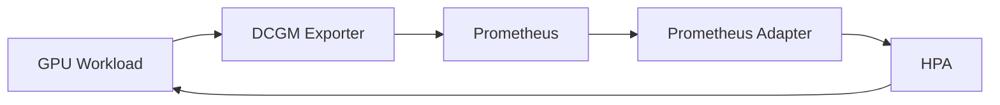

# AKS GPU Autoscaling Pattern

## Idea
- Run GPU workloads in AKS with efficient scaling

## Problem
- GPUs are expensive
- need to scale based on real usage
- unclear best autoscaling approach

## Options
- HPA based on CPU/memory
- KEDA with custom metrics
- Prometheus Adapter + GPU metrics (DCGM)

## Chosen
- Prometheus Adapter with GPU metrics

## Why
- supports real GPU utilization
- integrates with Kubernetes autoscaling model

## Scope
- NOT building full production system
- proving autoscaling based on GPU metrics works

## Architecture



- AKS cluster
- NVIDIA GPU Operator
- DCGM Exporter
- Prometheus
- Prometheus Adapter
- HPA

## Experiments

| # | Experiment | Expected outcome | Result |
|---|-----------|-----------------|--------|
| 1 | Deploy GPU workload | Pod running on GPU node | ✅ |
| 2 | Expose GPU metrics via DCGM | Metrics visible in Prometheus | ✅ |
| 3 | Validate metric availability | `DCGM_FI_DEV_GPU_UTIL` queryable | ✅ |
| 4 | Connect Prometheus Adapter | Custom metric available in k8s API | ✅ |
| 5 | Trigger HPA scaling | Replica count increases under load | ✅ |

## Result
- GPU metrics exposed correctly
- HPA responds to GPU utilization
- scaling behavior observed

## Finding
- CPU-based scaling insufficient
- GPU metrics required for correct scaling

## Pattern

Autoscale GPU workloads using:

```
Prometheus + DCGM + Prometheus Adapter + HPA
```
