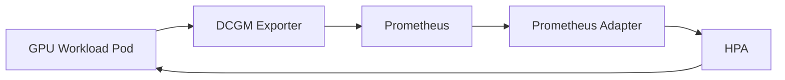

# /idea Autoscale GPU workloads in AKS based on real GPU utilization

> Output of running `/idea` — unedited.

## Hypothesis
- HPA on CPU/memory — available out of box, but ignores GPU state entirely
- KEDA with custom metrics — flexible, but adds an operator dependency
- Prometheus + DCGM + Prometheus Adapter + HPA — uses actual GPU utilization signal
- **chosen: Prometheus + DCGM Adapter**
- why: only option that reflects true GPU duty cycle; fits native Kubernetes HPA model

## Second-order effects
- Prometheus becomes a required cluster dependency — affects operational burden
- DCGM Exporter runs as DaemonSet — consumes resources on every GPU node
- HPA cooldown periods may cause under-provisioning during sharp burst loads
- metric cardinality grows with node count — Prometheus retention sizing needed

## Risks / Constraints
- DCGM Exporter requires NVIDIA GPU Operator — additional install prerequisite
- Prometheus Adapter config is non-trivial to get right for custom metrics
- HPA can only scale existing pods — does not provision new GPU nodes (needs Cluster Autoscaler)

## Scope
- not building: production autoscaling system, node provisioning, cost controls
- proving: GPU utilization metric is exposed, Prometheus Adapter surfaces it, HPA responds
- success: HPA scales pod count in response to `nvidia_gpu_duty_cycle` crossing threshold

## Architecture

- NVIDIA GPU Operator (installs DCGM Exporter as DaemonSet)
- Prometheus (kube-prometheus-stack)
- Prometheus Adapter (custom metrics API bridge)
- HPA targeting `nvidia_gpu_duty_cycle`

## Experiments
- deploy GPU workload pod + DCGM Exporter, confirm metric appears in Prometheus
- install Prometheus Adapter, verify metric is queryable via `kubectl get --raw`
- apply HPA manifest, simulate GPU load, observe replica scaling
- remove load, confirm scale-down within cooldown window

## Prototype
- start with `kube-prometheus-stack` helm chart
- add DCGM Exporter via GPU Operator or standalone DaemonSet
- configure Prometheus Adapter with `nvidia_gpu_duty_cycle` rule
- apply HPA with `averageValue: 70` (70% GPU utilization target)
